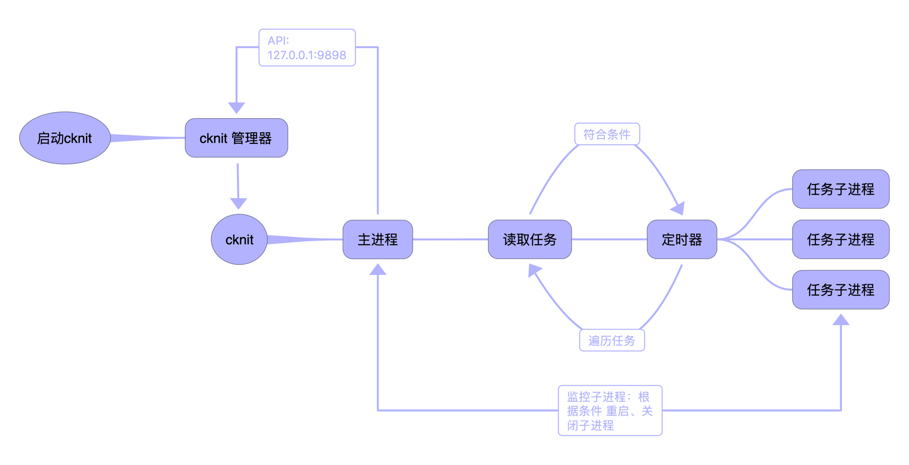

# cknit #

**cknit** 是一款开源高可用定时多任务管理工具，定时精度为秒级别 ( 相比**cron**增加了秒的取值 )，能够确保高效、稳定的处理多任务。
定时精度随任务量的变化如下所示：

| 任务数量 | 定时精度偏差 |
| :------: | :----------: |
|   1000   |    0.01s     |
|  100000  |      1s      |

# 支持平台 #

目前支持 **Linux**、**mac** 两大平台，mac 平台使用 select 系统调用，Linux平台使用 Posix (timer)，因此 Linux 平台性能比 mac 平台稍高，任务调度精度更佳

# 时间间隔格式

标准格式： 

`* * * * * *`  

| 列   | 含义 | 取值范围         |
| ---- | ---- | ---------------- |
| 1    | 秒   | 0-60             |
| 2    | 分   | 0-59             |
| 3    | 时   | 0-23             |
| 4    | 日   | 1-31             |
| 5    | 月   | 0-11 0:表示一月  |
| 6    | 周   | 0-6   0:表示周日 |

符号的含义：

| 特殊符号 | 含义            | 示例  |
| -------- | --------------- | ----- |
| *        | 每个取值都成立  | *     |
| /        | 每隔多少区间    | */2   |
| ,        | 多个取值 OR条件 | 2,3,4 |

示例：

- 每周三到周五上午10点30分每隔5秒

```shell
*/5 30 10 * * 3-5
```

- 每天早上8点10分每秒

```shell
* 10 8 * * *
```

- 每周二，周五，周日的下午1点每两秒

```shell
*/2 0 13 * * 2,5,0
```

- 八月八日八点八分每30秒

```shell
*/30 8 8 8 8 0-6
```

**cknit** 兼容 `cron` 表达式语言，cknit自己实现的解析引擎， 不需要依赖 cron 就可以完美运行，如果各位在使用的过程中发现任何问题，欢迎 issue

# 设计架构 #



# 安装 #

**cknit** 采用 **cmake** 编译系统，因此需要目标机器安装 **cmake 3.13** 及以上版本

**1、下载源码**

```shell
git clone https://gitee.com/josinli/cknit.git
```

**2、编译**

```shell
mkdir build
cd build
cmake ..
make && make install
cknit -k start
```

**3、配置**

**默认情况下，执行安装后，cknit的配置文件会存在于 /etc/cknit目录下，其中 ：**

| default_api.exjson |             访问API首页的响应内容             |
| :----------------- | :-------------------------------------------: |
| **cknit.exjson**   |              **cknit的系统配置**              |
| **task.exjson**    | **cknit的默认任务配置，启动的时候会自动加载** |

**4、配置文件格式**

**cknit采用Exjson格式的配置文件，兼容JSON文件，在JSON的文件基础上增加了部分特性：**

特性一：支持注释，`Exjson` 的注释是 `//` 或者 `#` 开头

特性二：配置文件支持 特殊的符号： `on` 和 `off`

**序列化和反序列化的结果情况下如下表：**

| 特殊符号  | 含义       | 解析结果   | 是否支持反序列化 |
| --------- | ---------- | ---------- | ---------------- |
| **true**  | 布尔值：真 | 整型值 `1` | 支持             |
| **false** | 布尔值：假 | 整型值 `0` | 支持             |
| **on**    | 开启       | 整型值 `1` | 不支持           |
| **off**   | 关闭       | 整型值 `0` | 不支持           |
| **null**  | 空         | 整型值 `0` | 支持             |

**4、日志**

默认情况下日志记录在: **/var/log/cknit** 目录下

**5、默认添加的任务状态都是未启动的，需要通过接口更改任务状态，方才可以生效，或者添加任务的时候，手工指定任务状态: `status` 等于 on|true**， 如：

```
POST http://localhost:9898/monitors
{
	"command":"php ~/Desktop/index.php", 
	"period": "*/2 * * * * *", 
	"status":ON
}
```

# APIs管理 #

安装完成后，访问：

```
http://127.0.0.1:9898
```

响应如下：

```
{
    "message": "Welcome use cknit",
    "version": "1.0",
    "code" : "OK",
    "port" : 9898,
    "APIs" : [
        {
            "name": "Get all exists tasks",
            "method": "GET",
            "protocol": "HTTP/1.1",
            "url": "http://127.0.0.1:9898/monitors"
        },
        {
            "name": "Add task",
            "method": "POST",
            "protocol": "HTTP/1.1",
            "url": "http://127.0.0.1:9898/monitors"
        },
        {
            "name": "Modify task",
            "method": "PUT",
            "protocol": "HTTP/1.1",
            "url": "http://127.0.0.1:9898/monitors"
        },
        {
            "name": "Delete task",
            "method": "DELETE",
            "protocol": "HTTP/1.1",
            "url": "http://127.0.0.1:9898/monitors"
        }
    ]
}
```

### API: 获取当前所有的任务 ###

```
GET http://127.0.0.1:9898/monitors
```

| 名称     | 取值 |
| -------- | ---- |
| 请求报文 | 无   |
| 报文格式 | JSON |

响应回答如下：

```
[
    {
        "command": "php ~/Desktop/index.php",
        "period": "* 1,2,3,10-20 * * * *",
        "id": 1,
        "status": -1
    },
    {
        "command": "php ~/Desktop/index.phpd",
        "period": "* * * * * * */2",
        "id": 2,
        "status": -1
    }
]
```

### API: 在线添加任务 ###

```
POST http://127.0.0.1:9898/monitors
{
	"command": "php ~/Desktop/index.php",
	"period": "* * * * * */2"
}
```

| 名称     | 取值                                                         |
| -------- | ------------------------------------------------------------ |
| 请求报文 | { "command":"定时任务名称", "period":"定时间隔"}             |
| 参数     |                                                              |
| command  | 定时任务名称                                                 |
| period   | 定时间隔                                                     |
| status   | 可选值，默认添加的任务不开启，如果此字段设置为 `1` 、 `ON` 或者 `true`，那么表示添加完成就开启任务 |
| 报文格式 | JSON                                                         |

响应回答如下：

```
{
    "message": "Success",
    "code": "true",
    "operation": "Add task"
}
```

### API: 在线修改已存任务(id是系统自动分配的) ###

```
PUT http://127.0.0.1:9898/monitors
{
	"id": 998,
	"data": {
		"status":0,
		"period": "* * * 11 * */2",
	}
}
```

| 名称     | 取值                                                         |
| -------- | ------------------------------------------------------------ |
| 请求报文 | { "id":1, "data":{"status":0, "period":"* * * * * *", "comment":"python novel.py 2&>1/dev/null"}}} |
| 参数     |                                                              |
| id       | 任务id，添加完任务后，系统自动分配ID ( ID无法修改，统一由系统维护 ) |
| data     | 需要修改的数据内容体                                         |
| status   | 设置任务的状态：0(未开启) 1(开启)   对应的符号变量：true\|on -> 1  false\|off -> 0 |
| period   | 设置任务的定时间隔                                           |
| comment  | 设置任务的执行命令                                           |
| 报文格式 | JSON                                                         |

响应回答如下：

```
{
    "message": "Success",
    "code": "true",
    "operation": "Modify task"
}
```

### API: 在线删除已存任务(id是系统自动分配的) ###

```
DELETE http://127.0.0.1:9898/monitors
{
	"id": 998
}
```

| 名称     | 取值                             |
| -------- | -------------------------------- |
| 请求报文 | {"id":1}                         |
| 参数     |                                  |
| id       | 任务id，添加任务后，系统自动分配 |
| 报文格式 | JSON                             |

响应应答报文如下：

```
{
    "message": "Success.",
    "code": "true"
}
```


